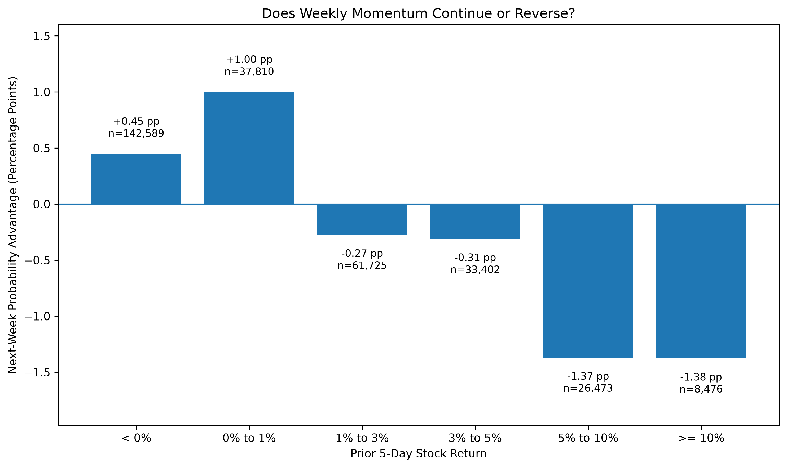
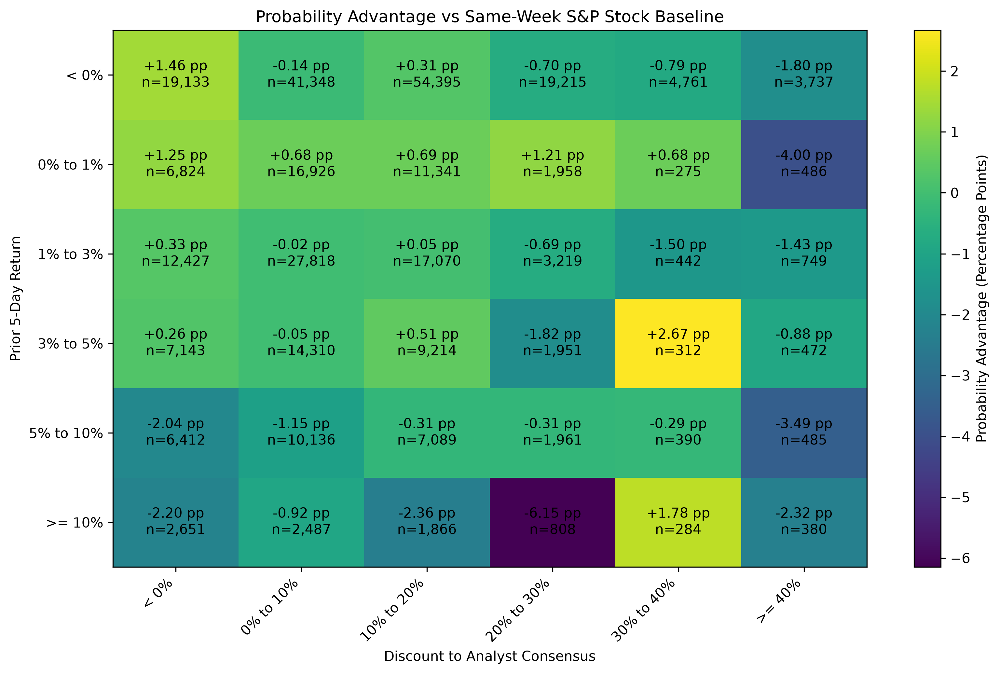

# Analyst Value & Momentum

## Overview

This project investigates whether short-term stock momentum becomes more
predictive when supported by analyst-implied undervaluation.

The original hypothesis was:

> Stocks experiencing positive weekly momentum should be more likely to
> continue rising when analyst consensus price targets imply substantial
> undervaluation.

Using historical S&P 500 constituents, CRSP security data, and point-in-time
I/B/E/S analyst price targets from 2005–2025, I constructed a weekly research
panel to test this relationship while reducing survivorship bias and avoiding
look-ahead bias.

The results do not support the original hypothesis. Analyst-implied
undervaluation did not consistently strengthen short-term momentum.
Instead, the strongest pattern was evidence of short-term reversal following
large positive weekly returns.

## Data & Methodology

The analysis combines:

- Historical S&P 500 membership to reduce survivorship bias
- CRSP daily security prices and returns
- I/B/E/S analyst price targets
- CRSP/I/B/E/S historical identifier links using PERMNO
- S&P 500 returns as a market benchmark

Daily stock data were converted into weekly observations containing prior
5-day and subsequent 5-day returns.

For each stock-week, analyst consensus was constructed using price targets
available before the signal date. Only the most recent target from each
analyst within the previous 30 days was included, with analysts weighted
equally.

Stocks were grouped according to prior-week return and their discount or
premium to analyst consensus.

To control for market conditions, signal performance was compared with the
probability of other eligible S&P 500 constituents rising during the same
historical weeks.

## Main Results

The relationship between prior-week returns and subsequent relative
performance showed increasing evidence of reversal as weekly gains became
larger.

| Prior-week return | Next-week probability advantage |
|---|---:|
| < 0% | +0.45 pp |
| 0–1% | +1.00 pp |
| 1–3% | -0.27 pp |
| 3–5% | -0.31 pp |
| 5–10% | -1.37 pp |
| >= 10% | -1.38 pp |

Probability advantage measures the difference between a momentum group's
probability of rising the following week and the contemporaneous probability
for eligible S&P 500 constituents.

## Statistical Significance

| Prior-week return | Observations | Weeks | Effect | 95% CI | p-value |
|---|---:|---:|---:|---:|---:|
| 5–10% | 26,473 | 1,067 | -1.37 pp | [-2.55, -0.19] | 0.023 |
| >= 10% | 8,476 | 903 | -1.38 pp | [-3.44, +0.69] | 0.191 |

The 5–10% momentum group exhibited statistically significant evidence of
short-term reversal. Stocks in this group were approximately 1.37 percentage
points less likely to rise the following week than contemporaneous eligible
S&P 500 constituents.

The >=10% group produced a similarly negative point estimate, but the result
was not statistically significant.

## Analyst Valuation Results

Analyst-implied undervaluation did not consistently increase the probability
of momentum continuation.

Across momentum buckets, increasing analyst discount did not produce a
monotonic improvement in subsequent performance. This provides little
evidence for the project's original hypothesis that analyst-implied
undervaluation strengthens short-term momentum.

## Conclusion

The original hypothesis was not supported.

After controlling for contemporaneous market conditions, analyst-implied
undervaluation did not consistently make positive weekly momentum more likely
to continue.

Instead, the analysis found evidence consistent with short-term mean
reversion following large positive weekly moves. Stocks gaining 5–10% in the
prior week were significantly less likely to rise the following week relative
to contemporaneous S&P 500 constituents.

The results also illustrate the importance of appropriate benchmarking:
patterns that appeared meaningful in unconditional positive-return rates
became substantially weaker after comparison with stocks trading during the
same historical periods.

## Limitations

- Analyst price targets may adjust slowly following large price movements.
- Analyst coverage varies across companies and time.
- The analysis tests historical relationships rather than a transaction-cost-
  adjusted trading strategy.
- Statistical significance does not imply that the relationship will persist
  out of sample.
- Multiple market and firm-specific factors beyond momentum and analyst
  valuation are not modeled.

## Technologies

Python, pandas, NumPy, SciPy, Matplotlib, WRDS, CRSP, I/B/E/S